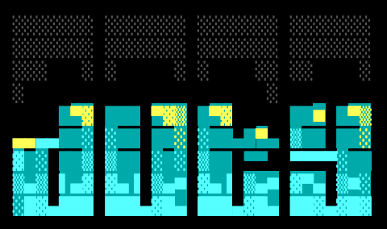
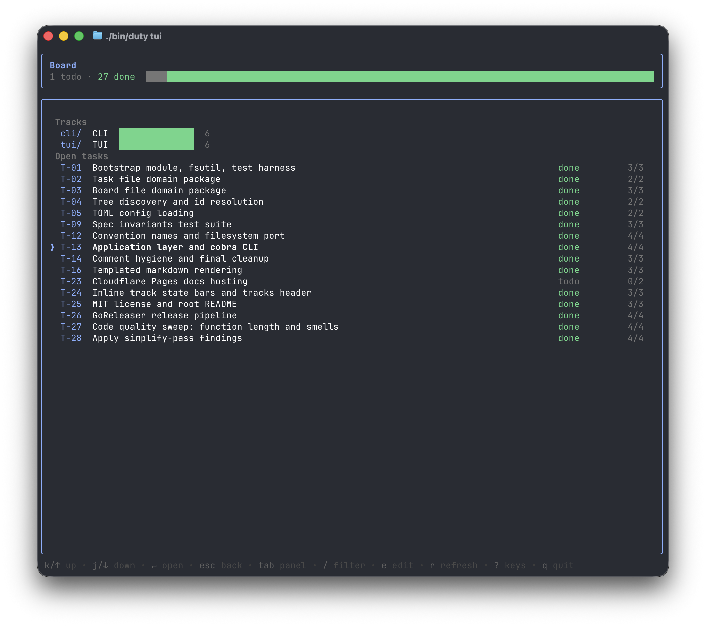

# duty
.

A little task system that lives in your repo as plain markdown files. No app, no
database, no account — just files you can grep, diff, and commit, and one binary
that gives you a CLI and a live TUI on top of them.

Tasks are markdown files. Tracks are folders, and they nest. A `BOARD.md` in each
track keeps the order. That's the whole model.

It's built for working *with* your coding agent: the agent drives tasks from the
CLI while you keep `duty tui` open and watch every status change land in real
time — who's on what, what's blocked, what's done — without asking.



## Install

```sh
brew install raphaelCamblong/tap/duty
# or
go install github.com/raphaelCamblong/duty/cmd/duty@latest
```

Prebuilt binaries live on the [releases page](https://github.com/raphaelCamblong/duty/releases).

Docs: the same pages, nicely rendered — [duty.raph-camblong.workers.dev](https://duty.raph-camblong.workers.dev).

## Use it

```sh
duty init "My project"            # scaffolds ./duty
duty create track api             # a track is just a folder
duty create task "Ship the thing"
duty create task "Add auth" --in api   # target any board by path, from anywhere
duty get next                     # what should I work on?
duty status T-01 in-progress
duty status T-01 done
duty tui                          # watch it all live
```

## Agents like it too

duty was built to be driven by AI agents: commands are quiet, exit codes mean
things, and `--agent` turns any read into clean TSV. An agent's whole loop is four
calls: `duty get next --claim` → work → `duty gates check --all` →
`duty report --status done`. Each recurring step is one atomic write, so running a
swarm just works — `get next --claim` hands each agent a distinct task under a
tree-wide lock, and their writes never collide. Hand it
[duty/README.md](duty/README.md) and it knows the rules — and since the TUI
watches the files, you see its progress the moment it moves.

Want more? The docs under [docs/](docs/) cover tasks, tracks, the CLI, config, and
the TUI in depth, and [CLAUDE.md](CLAUDE.md) covers hacking on the code.

## Hacking on it

`just` wraps the dev commands — `just check` runs the pre-commit gate (fmt, vet,
lint, test) before you call anything done.

MIT — see [LICENSE](LICENSE).
